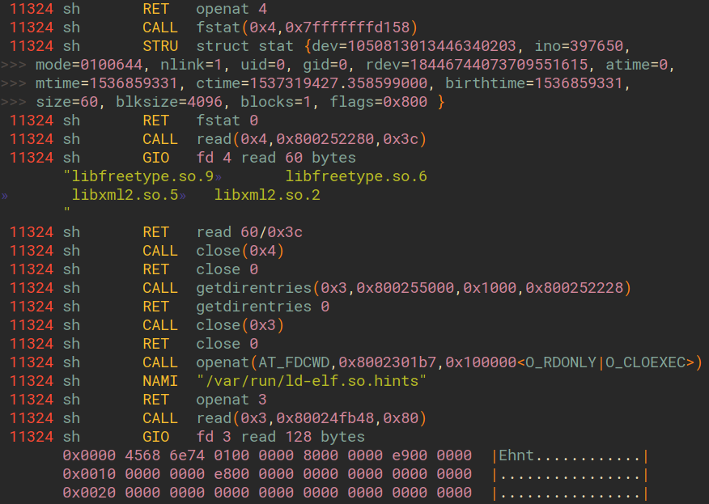

= vim-kdump

Vim syntax highlighting from FreeBSD's
https://www.freebsd.org/cgi/man.cgi?query=kdump&sektion=1[`kdump(1)`]
output (which is derived from binary
https://www.freebsd.org/cgi/man.cgi?query=ktrace&sektion=1[`ktrace(1)`]
output).

.Output from kdump highlighted with this syntax definition and the https://github.com/morhetz/gruvbox[Gruvbox] theme

== Installation

1. Install https://github.com/tpope/vim-pathogen[Pathogen].
2. `git clone https://github.com/trombonehero/vim-kdump ~/.vim/bundle/vim-kdump`
   (or use submodules if you prefer)

== Usage

Syntax highlighting will be applied when you either:

1. open a file named `\*.[k]dump` or `*.ktrace`; or
2. execute `set syntax=kdump`.
